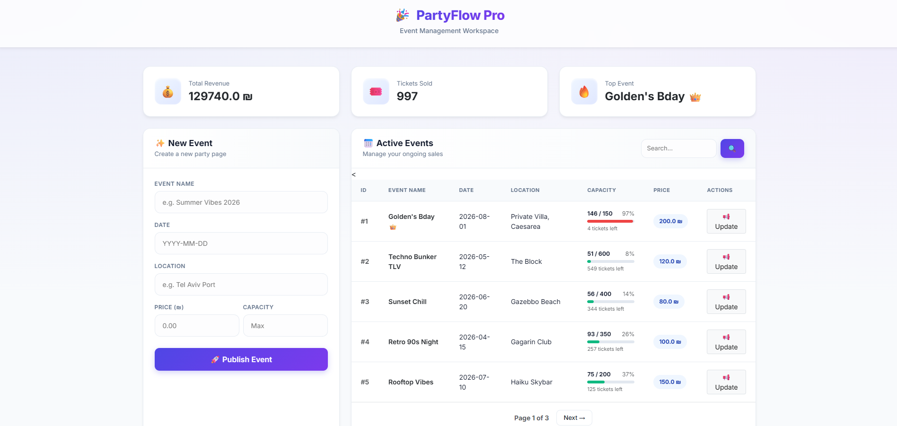
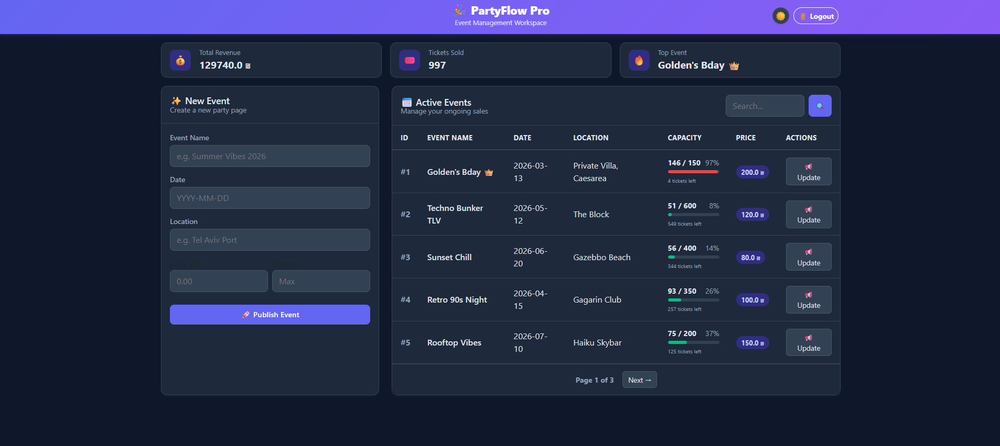

# 🎉 PartyFlow - Event Management & Ticketing System

<!-- 
 -->

**PartyFlow** is a comprehensive Full Stack solution for managing party lines and ticket sales.
It combines a user-friendly **Telegram Bot** for customers, a professional **Web Dashboard** for admins, and secure payment processing via **Stripe**.


---

## 🚀 Key Features

### 🤖 For Users (Telegram Bot)
* **Browse Events:** View upcoming parties with real-time details.
* **🎫 My Tickets & QR:** Access purchased tickets instantly via `/my_tickets` with dynamic **QR Code generation** for entry.
* **Smart Registration:** Interactive flow with **phone number validation** (Israel format).
* **💳 Secure Payments:** Integrated **Stripe Checkout** for secure credit card processing.
* **Sold Out Logic:** Prevents overbooking automatically.

### 🖥️ For Admins & Dashboard
* **📉 Real-Time Capacity:** Visual progress bars showing **Sold vs. Total** tickets per event.
* **🔍 Search & Pagination:** Easily manage hundreds of events with smart filtering and page navigation.
* **📢 High-Speed Broadcast:** Async messaging (**aiohttp**) to notify thousands of attendees in seconds without server lag.
* **⏰ Auto-Reminders:** Background task (**APScheduler**) sends automatic notifications to guests on the day of the event.
* **📊 Live Analytics:** Real-time stats on **Revenue**, **Tickets Sold**, and **Top Events**.

---

## 🛠️ Tech Stack

* **Backend:** FastAPI (Python)
* **Database:** SQLite (Managed via custom `db_manager`)
* **Payments:** Stripe API
* **Frontend (Web):** Jinja2 Templates + Bootstrap 5 + Custom CSS
* **Frontend (Bot):** pyTelegramBotAPI (Telebot)
* **Performance:** `aiohttp` (Async Broadcasting), `APScheduler` (Background tasks)
* **Utilities:** `qrcode`, `phonenumbers`

---
## ⚙️ Installation & Setup

1.  **Clone the repository:**
    ```bash
    git clone [https://github.com/YossiGold99/PartyFlow.git](https://github.com/YossiGold99/PartyFlow.git)
    cd PartyFlow
    ```

2.  **Install Dependencies:**
    ```bash
    pip install -r requirements.txt
    ```

3.  **Environment Variables:**
    * Duplicate `.env.example` and rename it to `.env`.
    * Add your Telegram Bot Token, Stripe Keys, and Admin Password.

4.  **Run the Server:**
    ```bash
    uvicorn main:app --reload
    ```

5.  **Run the Bot:**
    ```bash
    python bot.py
    ```

## 📂 Project Structure

```text
PartyFlow/
├── core/
│   └── db_manager.py       # Database logic & SQL queries
├── database/
│   └── party_bot.db        # SQLite file (Auto-generated)
├── static/
│   ├── style.css           # Custom CSS for the dashboard
│   └── dashboard_preview.png
├── templates/
│   ├── dashboard.html      # HTML Admin Interface (Jinja2)
│   └── success.html        # Payment Success Page
├── bot.py                  # Telegram Bot Logic (Frontend 1)
├── main.py                 # FastAPI Server, Async Tasks & Scheduler
├── .env                    # Environment variables (Tokens & Keys)
└── requirements.txt        # Python dependencies
```

---

## 📸 Screenshots

| Light Mode | Dark Mode |
|:----------:|:---------:|
|  |  |

---
*Developed by Yossi Gold - Full Stack Developer*
---
Created as a final project for Python Course 2025
---


